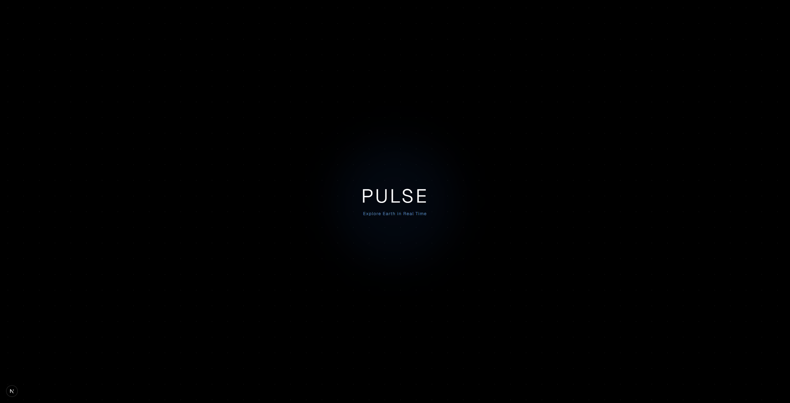

# 🌍 Pulse

> **A living digital Earth.**
>
> Explore the planet in real time through an immersive 3D globe that visualizes flights, earthquakes, wildfires, satellites, the International Space Station, weather events, and much more.



> **⚠️ Project Status:** Early Development (Frontend Foundation)

---

## ✨ Overview

Pulse is an interactive globe built to make exploring our planet intuitive, beautiful, and engaging.

Instead of browsing multiple websites for global information, Pulse aims to bring everything together into a single immersive experience where Earth itself becomes the interface.

The long-term vision is to create a platform that allows anyone to explore real-world events as they happen.

---

## 🎯 Vision

Pulse is designed around one simple idea:

> **The Earth is the interface.**

Every interaction starts from the globe.

Instead of opening dashboards or lists, users explore the world naturally by rotating, zooming, and discovering what's happening around the planet.

---

## 🚀 Planned Features

### 🌍 Interactive Globe

* Smooth 3D Earth rendering
* Premium camera controls
* Atmospheric effects
* Dynamic lighting
* Cloud layer
* Responsive design

### 🌎 Live Earth Layers

* ✈️ Flights
* 🌋 Earthquakes
* 🔥 Wildfires
* 🛰️ International Space Station
* 🛰️ Satellites
* ⚡ Lightning
* 🌦️ Weather Systems
* 🚢 Ships
* 🌋 Volcanoes
* 🚀 Rocket Launches
* 🌌 Aurora
* 🌐 Internet Cables

---

## 🛠️ Current Progress

### ✅ Completed

* Interactive 3D Globe
* Smooth camera controls
* Atmosphere rendering
* Animated cloud layer
* Starfield background
* Glassmorphism UI
* Real-time ISS visualization
* Mock visualization system
* Responsive layout

### 🚧 In Progress

* Performance optimization
* Realistic Earth rendering
* Layer refinement
* Better shaders
* Globe interaction improvements

### 📋 Planned

* Live API integrations
* Historical timeline
* Advanced search
* Saved locations
* Mobile optimization
* More visualization layers

---

## 🖼️ Preview

> Screenshots and demo GIFs coming soon.

---

## ⚙️ Tech Stack

### Frontend

* Next.js
* React
* TypeScript
* Tailwind CSS
* React Three Fiber
* Three.js
* Framer Motion
* Zustand

### Future Backend

* Node.js
* Express.js
* MongoDB
* WebSockets
* Redis

---

## 📦 Getting Started

Clone the repository

```bash
git clone https://github.com/vmDeshpande/pulse.git
```

Install dependencies

```bash
npm install
```

Start the development server

```bash
npm run dev
```

Open

```
http://localhost:3000
```

---

## 🗺️ Roadmap

### Phase 1

* [x] Frontend foundation
* [x] Interactive globe
* [x] Camera system
* [x] Initial visualization layers
* [ ] Performance optimization

### Phase 2

* [ ] Real Earth textures
* [ ] Live flight data
* [ ] USGS Earthquakes
* [ ] NASA ISS data
* [ ] Wildfire APIs

### Phase 3

* [ ] Weather systems
* [ ] Satellite tracking
* [ ] Internet cables
* [ ] Historical playback
* [ ] Time controls

### Phase 4

* [ ] Mobile experience
* [ ] User collections
* [ ] Analytics
* [ ] Public API
* [ ] Community plugins

---

## 🤝 Contributing

Contributions are welcome!

Whether you're interested in graphics programming, frontend development, performance optimization, UI/UX, or data visualization, feel free to open an issue or submit a pull request.

---

## ⭐ Support

If you like the project, consider giving it a **star** on GitHub. It helps others discover Pulse and motivates future development.

---

## 📜 License

This project is licensed under the MIT License.

---

## 💡 Inspiration

Pulse draws inspiration from products and technologies such as:

* Google Earth
* FlightRadar24
* NASA Eyes
* CesiumJS
* Three.js
* Apple Maps
* Arc Browser

The goal is not to replicate them, but to create a unique experience that combines beautiful visualization with real-time global awareness.

---

<div align="center">

### 🌍 Pulse

**Explore Earth. Understand the World.**

Made with ❤️ using React, Three.js and curiosity.

</div>
